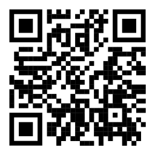
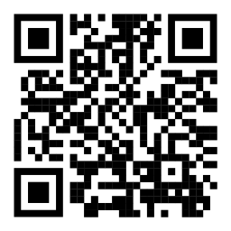
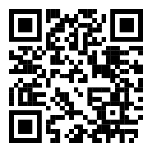

## Weather Forecast

Mobile application to get weather data by scanning QR-Code.

---

## Overview

Project is built using React Native and Expo. Weather data is taken from OpenWeather https://openweathermap.org/.

---

## QR-Codes

## Getting Started

To start using the app, follow these simple steps:

1. Clone the repository to your local machine.
2. Navigate to the project directory.
3. Install dependencies using `npm install`.
4. Start the project with `npm run start`.
